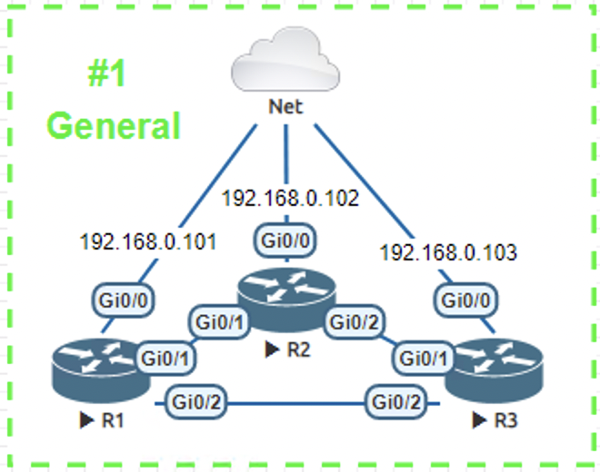

## Topology



## Router Config
### R1, R2 & R3
The config is the same for all three devices, just make sure to change the `hostname` and `ip address` !!
```python
en
conf t
hostname R1
ip domain-name blacognito.com
ip ssh version 2
crypto key generate rsa modulus 1024
line vty 0 4
transport input ssh
login local
exit
username blacognito privilege 15 secret cisco
int g0/0
ip address 192.168.0.101 255.255.255.0
no shut
end
wr
```

